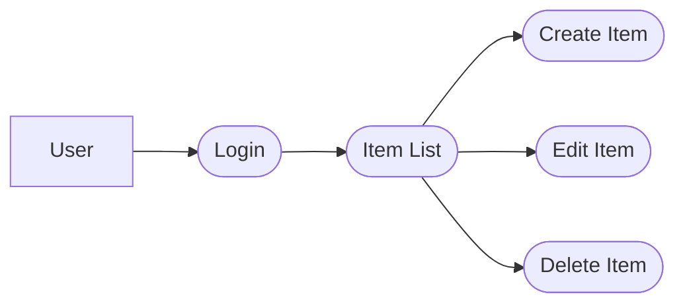
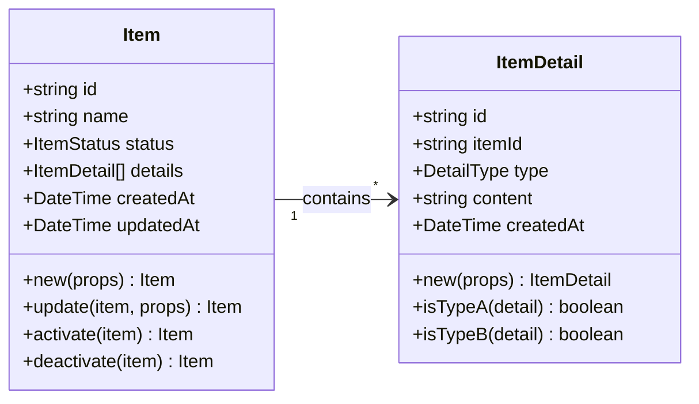
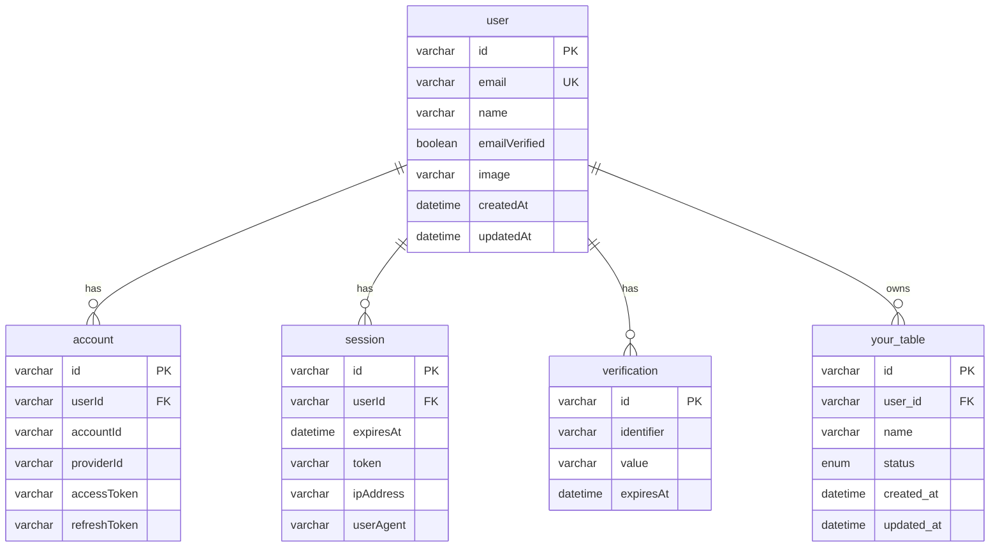

# Domain Model

## Overview

This document defines the design guidelines and structure for domain modeling. Application-specific domain models should be implemented following these guidelines.

## File Structure

Domain models are organized into directories by aggregate, with a clear separation between each aggregate's root entity and value objects.

```
services/api/domain/
└── [your-domain]/           # Application-specific aggregate
    ├── [aggregate-root].ts  # Aggregate root
    ├── [value-object].ts    # Value object
    ├── [entity].ts          # Child entity
    └── index.ts             # Barrel file
```

## Domain Model Design Guidelines

### 1. Zod Schema First

All type definitions are derived from Zod schemas:

```typescript
// item.ts
export const itemSchema = z.object({
  id: z.string(),
  name: z.string(),
  status: z.enum(["active", "inactive"]),
  createdAt: z.date(),
});
export type Item = z.infer<typeof itemSchema>;
```

### 2. Domain Methods Use the Companion Object Pattern

Each domain model has factory methods and business logic in a companion object of the same name.
Public functions should have preconditions and postconditions documented in JSDoc. See [Function Documentation Conventions](./function-documentation.md) for details.

```typescript
// item.ts
export const Item = {
  new: (props: CreateItemProps): Item => { ... },
  update: (item: Item, props: UpdateProps): Item => { ... },
  activate: (item: Item): Item => { ... },
  deactivate: (item: Item): Item => { ... },
} as const;
```

### 3. Type Guards and Utilities

When using Discriminated Unions, also provide type guard functions:

```typescript
// item-detail.ts (Discriminated Union example)
export const ItemDetail = {
  isTypeA: (detail: ItemDetail): detail is TypeADetail =>
    detail.type === "type_a",
  isTypeB: (detail: ItemDetail): detail is TypeBDetail =>
    detail.type === "type_b",
  default: (): DefaultDetail => ({ type: "default" }),
} as const;
```

### 4. Immutable Updates

All update operations return new objects:

```typescript
const updatedItem = Item.update(item, { name: "New name" });
const activatedItem = Item.activate(item);
```

## Repository Design Guidelines

### 1. Leverage drizzle-zod Schemas as DTOs

The repository layer leverages `select*Schema` generated by Drizzle as DTOs, minimizing manual mapping:

```typescript
import {
  type SelectItem,
  type SelectItemDetail,
  itemsTable,
  selectItemDetailsSchema,  // drizzle-zod schema
  itemDetailsTable,
} from "./mysql/schema";

// Helper to convert DB item + details to domain aggregate
const toItemAggregate = (
  item: SelectItem,
  details: SelectItemDetail[],
): Item => ({
  id: item.id,
  name: item.name,
  // ... direct mapping
  // Use drizzle-zod schema as DTO for child entities
  details: details.map((row) => selectItemDetailsSchema.parse(row)),
});

// For simple entities, use schema directly
return Ok(selectItemsSchema.parse(result.val[0]));
```

### 2. Simple Mapping

Keep helper functions that convert DB rows to domain models simple:

```typescript
// Good: Simple mapping
const toItemAggregate = (
  item: SelectItem,
  details: SelectItemDetail[],
): Item => ({
  id: item.id,
  name: item.name,
  // ... direct mapping
  details: details.map(toItemDetail),
});

// Bad: Verbose expansion
const items = itemsResult.val.map((item) => ({
  id: item.id,
  name: item.name,
  // ... enumerating the same fields every time
}));
```

### 3. Avoiding the N+1 Problem

When fetching child entities of an aggregate, use `inArray` for bulk retrieval:

```typescript
// Good: Bulk retrieval
const itemIds = items.map((i) => i.id);
const detailsResult = await tx
  .select()
  .from(itemDetailsTable)
  .where(inArray(itemDetailsTable.itemId, itemIds));

// Group by itemId
const detailsByItemId = new Map<string, SelectItemDetail[]>();
for (const detail of detailsResult) {
  const existing = detailsByItemId.get(detail.itemId) ?? [];
  existing.push(detail);
  detailsByItemId.set(detail.itemId, existing);
}

// Bad: N+1 queries
for (const item of items) {
  const details = await tx
    .select()
    .from(itemDetailsTable)
    .where(eq(itemDetailsTable.itemId, item.id));
}
```

### 4. Align Domain Models with DB Models

Avoid excessive normalization and keep domain models as closely aligned with DB models as possible:

```typescript
// Good: Flat structure matching the DB
const itemMetricsSchema = z.object({
  id: z.string(),
  itemId: z.string(),
  metric1: z.number(),
  metric2: z.number(),
  metric3: z.number(),
  // ...
});

// Bad: Unnecessary normalization (converting to arrays)
const itemMetricsSchema = z.object({
  metrics: z.array(
    z.object({
      type: z.string(),
      value: z.number(),
    })
  ),
});
```

When API backward compatibility is required, perform the conversion in the DTO layer.

## Naming Conventions

### Database
- Table names: plural snake_case (`users`, `items`, `orders`)
- Column names: snake_case (`user_id`, `created_at`, `item_id`)
- Foreign keys: `{singular_referenced_table}_id` (`user_id`, `item_id`, `order_id`)

### Application
- Domain models: PascalCase (`User`, `Item`, `Order`)
- Type definitions: PascalCase (`ItemStatus`, `OrderType`)
- Type aliases (for export): `{Model}Type` (`UserType`, `ItemType`)
- Variables/Properties: camelCase (`itemId`, `createdAt`)
- Repositories: `{Model}Repository` (`ItemRepository`)
- Use cases: `{Model}UseCase` (`ItemUseCase`)

## Data Storage Principles

- **Per-user storage**: All data is stored in association with a User
- **Transaction management**: Operations spanning multiple repositories are managed with transactions in the use case layer
- **Error handling with Result type**: All errors are handled uniformly using the Result type
- **Aggregate-level updates**: Each aggregate is independently managed by its repository and use case, and persisted at the aggregate level

## Aggregate Boundaries

Each aggregate is managed by independent use cases and repositories.

### [YourAggregate] (Example)
- **Root entity**: [AggregateRoot]
- **Value objects**: [ValueObject1], [ValueObject2]
- **Child entities**: [ChildEntity]
- **Files**: `domain/[your-domain]/`
- **Use case**: `[YourAggregate]UseCase`
- **Repository**: `[YourAggregate]Repository`
- **Operations**: Create, Update, Retrieve, Delete
- **Key methods**:
  - `[AggregateRoot].new()` - Create
  - `[AggregateRoot].update()` - Update
  - `[AggregateRoot].[businessMethod]()` - Business logic

## Use Case Diagram (Example)



## Class Diagram (Example)



## ER Diagram (Example)



## Enums (Examples)

### ItemStatus
- `active` - Active
- `inactive` - Inactive
- `archived` - Archived

### DetailType
- `type_a` - Type A
- `type_b` - Type B
- `default` - Default

## API Endpoints (Examples)

### Item API
- `GET /items` - Get item list
  - Response: `{ items: [{ id, name, status, createdAt, ... }] }`
- `POST /items` - Create item
  - Request: `{ name, status? }`
  - Response: `{ id, name, status, createdAt, updatedAt }`
- `GET /items/{itemId}` - Get item
  - Response: `{ id, name, status, details, createdAt, updatedAt }`
- `PUT /items/{itemId}` - Update item
  - Request: `{ name?, status? }`
- `DELETE /items/{itemId}` - Delete item
