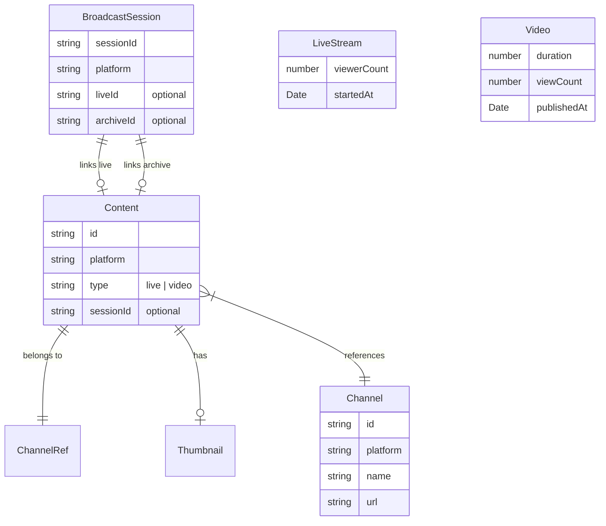

# Entities

## Entity List

| Entity | Aggregate | Description |
| --- | --- | --- |
| Content | Root | Discriminated union: the unified abstraction over LiveStream and Video |
| LiveStream | Content subtype | A currently broadcasting live stream (`type: "live"`) |
| Video | Content subtype | A recorded/archived video (`type: "video"`) |
| Channel | Root | A streaming channel on a platform |
| ChannelRef | Value Object | Lightweight channel reference embedded in Content |
| Thumbnail | Value Object | Image URL with dimensions |
| BroadcastSession | Root | Lifecycle link between a live stream and its resulting archive |
| Page\<T> | Value Object | Cursor-based pagination envelope |
| ResolvedUrl | Value Object | Result of URL parsing (platform, type, id) |

## Aggregates and Relationships



## Entity Details

### 1. Content (Discriminated Union Root)

- Purpose: The core abstraction that normalizes live streams and videos across all platforms into a single type
- Aggregate Root: Yes
- Discrimination: `type: "live"` (LiveStream) or `type: "video"` (Video)

#### Key Attributes (Base)

| Attribute | Type | Required | Description |
| --- | --- | --- | --- |
| id | string | yes | Platform-specific resource ID |
| platform | string | yes | Platform name (`"youtube"`, `"twitch"`, `"twitcasting"`) |
| type | `"live" \| "video"` | yes | Discriminant field |
| title | string | yes | Content title |
| url | string | yes | Canonical URL on the platform |
| thumbnail | Thumbnail | yes | Thumbnail image |
| channel | ChannelRef | yes | Channel that owns this content |
| sessionId | string | no | Cross-platform session identifier (see Session Tracking) |
| raw | unknown | yes | Platform-specific raw API response |

#### Business Rules

- `id` format is platform-dependent (YouTube: 11-char base64, Twitch: numeric, TwitCasting: numeric)
- `sessionId` links a live stream to its archive. See Session Tracking section below.
- `raw` preserves the original API response for consumers who need platform-specific fields

#### Zod Schema Draft

```ts
import { z } from "zod";

const thumbnailSchema = z.object({
  url: z.string().url(),
  width: z.number().int().positive(),
  height: z.number().int().positive(),
});

const channelRefSchema = z.object({
  id: z.string().min(1),
  name: z.string(),
  url: z.string().url(),
});

const contentBaseSchema = z.object({
  id: z.string().min(1),
  platform: z.string().min(1),
  title: z.string(),
  url: z.string().url(),
  thumbnail: thumbnailSchema,
  channel: channelRefSchema,
  sessionId: z.string().optional(),
  raw: z.unknown(),
});

const liveStreamSchema = contentBaseSchema.extend({
  type: z.literal("live"),
  viewerCount: z.number().int().nonnegative(),
  startedAt: z.date(),
});

const videoSchema = contentBaseSchema.extend({
  type: z.literal("video"),
  duration: z.number().nonnegative(),
  viewCount: z.number().int().nonnegative(),
  publishedAt: z.date(),
});

const contentSchema = z.discriminatedUnion("type", [liveStreamSchema, videoSchema]);

type Thumbnail = z.infer<typeof thumbnailSchema>;
type ChannelRef = z.infer<typeof channelRefSchema>;
type LiveStream = z.infer<typeof liveStreamSchema>;
type Video = z.infer<typeof videoSchema>;
type Content = z.infer<typeof contentSchema>;
```

#### Companion Object Draft

```ts
export const Content = {
  isLive: (content: Content): content is LiveStream => content.type === "live",
  isVideo: (content: Content): content is Video => content.type === "video",
} as const;
```

---

### 2. LiveStream

- Purpose: Represents a currently broadcasting live stream
- Aggregate Root: No (subtype of Content)

#### Additional Attributes

| Attribute | Type | Required | Description |
| --- | --- | --- | --- |
| viewerCount | number | yes | Current concurrent viewer count |
| startedAt | Date | yes | When the broadcast started |

#### Business Rules

- `viewerCount` is non-negative (0 when platform doesn't report)
- `startedAt` must be in the past or present

---

### 3. Video

- Purpose: Represents a recorded/archived video
- Aggregate Root: No (subtype of Content)

#### Additional Attributes

| Attribute | Type | Required | Description |
| --- | --- | --- | --- |
| duration | number | yes | Video length in seconds |
| viewCount | number | yes | Total view count |
| publishedAt | Date | yes | When the video was published/made available |

#### Business Rules

- `duration` is non-negative (0 for live-ended videos still processing)
- `viewCount` is non-negative

---

### 4. Channel

- Purpose: A streaming channel on a platform
- Aggregate Root: Yes

#### Key Attributes

| Attribute | Type | Required | Description |
| --- | --- | --- | --- |
| id | string | yes | Platform-specific channel/user ID |
| platform | string | yes | Platform name |
| name | string | yes | Display name |
| url | string | yes | Canonical channel URL |
| thumbnail | Thumbnail | no | Channel icon/avatar |

#### Zod Schema Draft

```ts
const channelSchema = z.object({
  id: z.string().min(1),
  platform: z.string().min(1),
  name: z.string(),
  url: z.string().url(),
  thumbnail: thumbnailSchema.optional(),
});

type Channel = z.infer<typeof channelSchema>;
```

---

### 5. BroadcastSession

- Purpose: Links a live stream to its resulting archive video across the session lifecycle
- Aggregate Root: Yes

#### Key Attributes

| Attribute | Type | Required | Description |
| --- | --- | --- | --- |
| sessionId | string | yes | Platform-specific session identifier |
| platform | string | yes | Platform name |
| channel | ChannelRef | yes | Channel that owns the broadcast |
| startedAt | Date | yes | When the broadcast started |
| endedAt | Date | no | When the broadcast ended (null if still live) |
| contentIds.liveId | string | no | Live stream content ID |
| contentIds.archiveId | string | no | Archive video content ID |

#### Zod Schema Draft

```ts
const broadcastSessionSchema = z.object({
  sessionId: z.string().min(1),
  platform: z.string().min(1),
  channel: channelRefSchema,
  startedAt: z.date(),
  endedAt: z.date().optional(),
  contentIds: z.object({
    liveId: z.string().optional(),
    archiveId: z.string().optional(),
  }),
});

type BroadcastSession = z.infer<typeof broadcastSessionSchema>;
```

---

### 6. Page\<T>

- Purpose: Cursor-based pagination envelope for list operations
- Value Object

#### Key Attributes

| Attribute | Type | Required | Description |
| --- | --- | --- | --- |
| items | T[] | yes | Items in the current page |
| cursor | string | no | Cursor for next page (undefined if last page) |
| total | number | no | Total item count (if platform provides it) |

#### Zod Schema Draft

```ts
const pageSchema = <T extends z.ZodType>(itemSchema: T) =>
  z.object({
    items: z.array(itemSchema),
    cursor: z.string().optional(),
    total: z.number().int().nonnegative().optional(),
  });

type Page<T> = {
  items: T[];
  cursor?: string;
  total?: number;
};
```

---

### 7. ResolvedUrl

- Purpose: Result of parsing a platform URL into its components
- Value Object

#### Key Attributes

| Attribute | Type | Required | Description |
| --- | --- | --- | --- |
| platform | string | yes | Detected platform name |
| type | `"content" \| "channel"` | yes | What the URL points to |
| id | string | yes | Extracted resource ID |

#### Zod Schema Draft

```ts
const resolvedUrlSchema = z.object({
  platform: z.string().min(1),
  type: z.enum(["content", "channel"]),
  id: z.string().min(1),
});

type ResolvedUrl = z.infer<typeof resolvedUrlSchema>;
```

---

## Session Tracking

### Problem

Twitch uses different IDs for live streams (Stream ID) and archives (Video ID). YouTube and TwitCasting use the same ID for both.

| Platform | Live ID | Archive ID | Same? |
| --- | --- | --- | --- |
| YouTube | `dQw4w9WgXcQ` | `dQw4w9WgXcQ` | Yes |
| Twitch | Stream ID: `44567123` | Video ID: `11223344` | **No** |
| TwitCasting | Movie ID: `789012` | Movie ID: `789012` | Yes |

### Solution: `sessionId` field

The `sessionId` field on Content provides a stable identifier that remains the same for both the live stream and its archive:

| Platform | sessionId source (live) | sessionId source (archive) | Mapping |
| --- | --- | --- | --- |
| YouTube | `video.id` | `video.id` | `id === sessionId` |
| Twitch | `stream.id` | `video.stream_id` | `sessionId` links different IDs |
| TwitCasting | `movie.id` | `movie.id` | `id === sessionId` |

When `sessionId` is not available (platform doesn't support the concept), the field is `undefined`.
