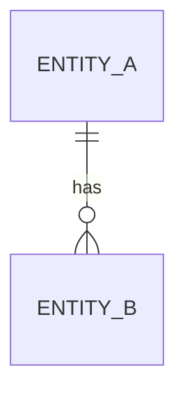

# Entities

## Entity List

| Entity | English Name | Aggregate | Description |
| --- | --- | --- | --- |
| TBD | TBD | TBD | TBD |

## Aggregates and Relationships



## Entity Details

### 1. TBD

- Japanese Name: TBD
- English Name: TBD
- Aggregate Root: TBD
- Purpose: TBD

#### Key Attributes

| Attribute | Type | Required | Description |
| --- | --- | --- | --- |
| id | string | yes | Identifier |

#### Business Rules

- TBD

#### Related Entities

- TBD

#### Zod Schema Draft

```ts
import { z } from "zod";

export const tbdSchema = z.object({
  id: z.string(),
});

export type Tbd = z.infer<typeof tbdSchema>;
```

#### Companion Object Draft

```ts
export const Tbd = {
  new: (props: Tbd): Tbd => props,
} as const;
```
